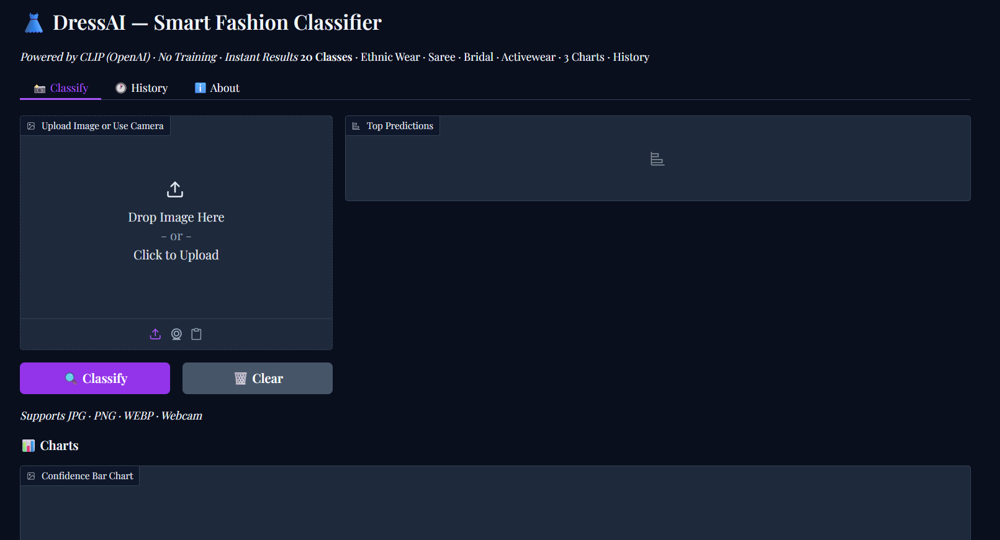
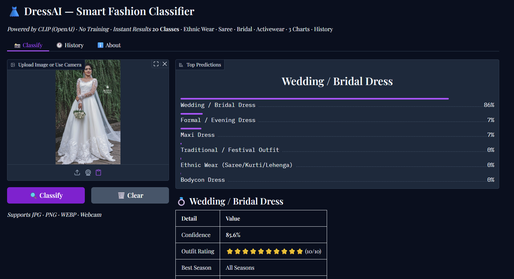
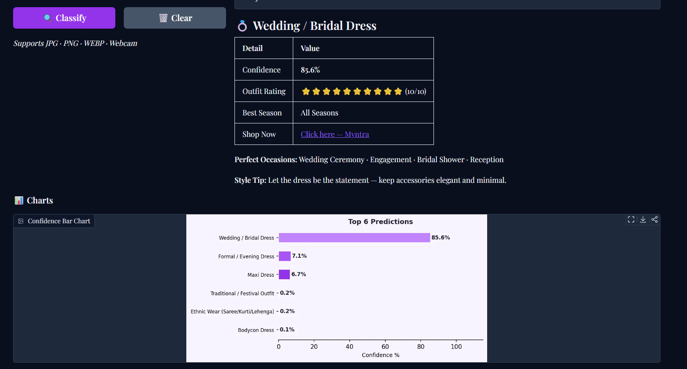
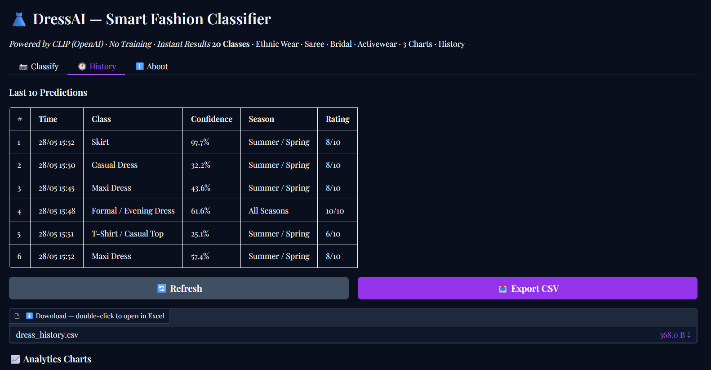
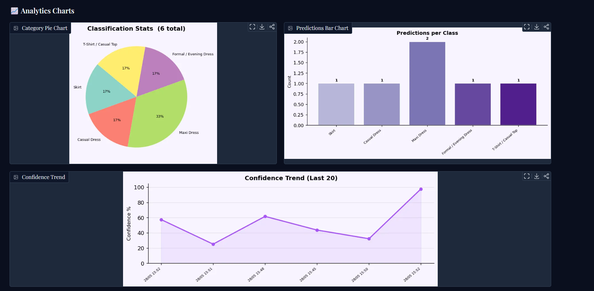

# 👗 DressAI – Smart Fashion Classifier using CLIP

An AI-powered fashion image classification system built using **OpenAI CLIP**, **Hugging Face Transformers**, **PyTorch**, and **Gradio**. The application performs **zero-shot image classification**, allowing users to classify clothing images into multiple fashion categories without any model training.

---

## 📌 Project Overview

DressAI is a smart fashion classifier that predicts clothing categories from uploaded images using the **CLIP (Contrastive Language–Image Pretraining)** model. Unlike traditional classifiers, CLIP does not require task-specific training. It compares image features with text descriptions to identify the most suitable category.

The application provides a modern web interface with prediction history, confidence analysis, and visual analytics, making it suitable for fashion-related AI applications.

---

## ✨ Features

- 👗 Zero-shot fashion image classification (No model training required)
- 🖼️ Upload images or use a webcam for predictions
- 📊 Displays Top-6 prediction confidence scores
- 📈 Interactive confidence bar charts
- 📜 Prediction history with export to CSV
- 📉 Analytics dashboard with pie chart, bar chart, and confidence trend
- ⭐ Outfit rating and best season recommendation
- 🛍️ Shopping link suggestion for predicted outfits
- 🌐 User-friendly Gradio web interface

---

## 🛠️ Tech Stack

- Python
- PyTorch
- OpenAI CLIP
- Hugging Face Transformers
- Gradio
- NumPy
- Pandas
- Matplotlib
- Pillow

---

## 🧠 Model Used

**Model:** `openai/clip-vit-base-patch32`

CLIP is a Vision Transformer (ViT)-based model trained on image-text pairs. It performs **zero-shot image classification** by comparing an image with natural language descriptions instead of relying on supervised training.

---

## 👕 Supported Fashion Categories

- T-Shirt / Casual Top
- Shirt
- Casual Dress
- Maxi Dress
- Formal / Evening Dress
- Wedding / Bridal Dress
- Traditional / Festival Outfit
- Ethnic Wear (Saree / Kurti / Lehenga)
- Skirt
- Jeans
- Jacket
- Hoodie
- Sweatshirt
- Blazer
- Shorts
- Tracksuit
- Leggings
- Coat
- Sweater
- Bodycon Dress

---

## 📂 Project Structure

```text
DressAI-CLIP-ZeroShot-Classifier/
│
├── notebook/
│   └── dress_classifier_no_training.ipynb
│
├── images/
│   ├── home.png
│   ├── prediction1.png
│   ├── prediction2.png
│   ├── history.png
│   └── analytics.png
│
├── requirements.txt
├── README.md
└── .gitignore
```

---

## 🚀 Installation

### Clone the Repository

```bash
git clone https://github.com/your-username/DressAI-CLIP-ZeroShot-Classifier.git
cd DressAI-CLIP-ZeroShot-Classifier
```

### Install Dependencies

```bash
pip install -r requirements.txt
```

### Run the Project

If using the notebook:

```bash
jupyter notebook
```

Open `dress_classifier_no_training.ipynb` and run all cells.

> If you later add an `app.py`, you can run:

```bash
python app.py
```

---

## 📸 Application Screenshots

### 🏠 Home Page



---

### 🎯 Prediction Result



---

### 📋 Prediction Details



---

### 📜 Prediction History



---

### 📊 Analytics Dashboard



---

## 🔄 Project Workflow

1. User uploads a fashion image.
2. Image is preprocessed using CLIP Processor.
3. Clothing category descriptions are converted into text embeddings.
4. CLIP compares image and text embeddings.
5. Similarity scores are calculated.
6. Top predictions are displayed with confidence scores.
7. Prediction history and analytics are updated automatically.

---

## 📊 Key Highlights

- Zero-shot image classification
- No custom model training
- Interactive web interface
- Fashion analytics dashboard
- CSV export for prediction history
- Confidence visualization
- Real-time predictions

---

## 🔮 Future Enhancements

- Support for additional clothing categories
- Multi-label outfit classification
- Brand recognition
- Color and fabric detection
- Fashion recommendation system
- Mobile-friendly deployment
- Cloud deployment using Hugging Face Spaces or Streamlit Cloud

---

## 📚 Learning Outcomes

This project demonstrates knowledge of:

- Computer Vision
- Vision Transformers (ViT)
- Zero-Shot Learning
- Hugging Face Transformers
- Deep Learning
- Image Classification
- Interactive AI Applications
- Data Visualization

---

## 👩‍💻 Author

**Ananya**

M.Sc. Data Science

Interested in Artificial Intelligence, Machine Learning, Computer Vision, and Data Science.

---

## 📄 License

This project is licensed under the **MIT License**.